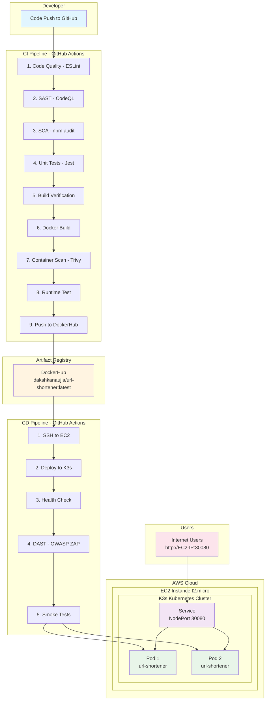
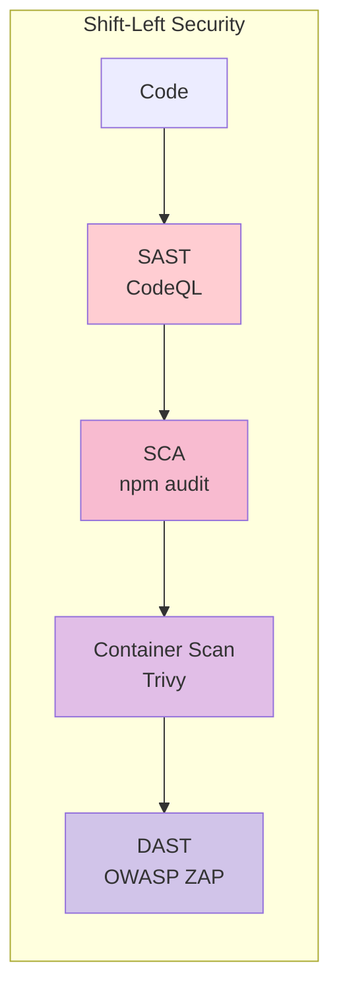
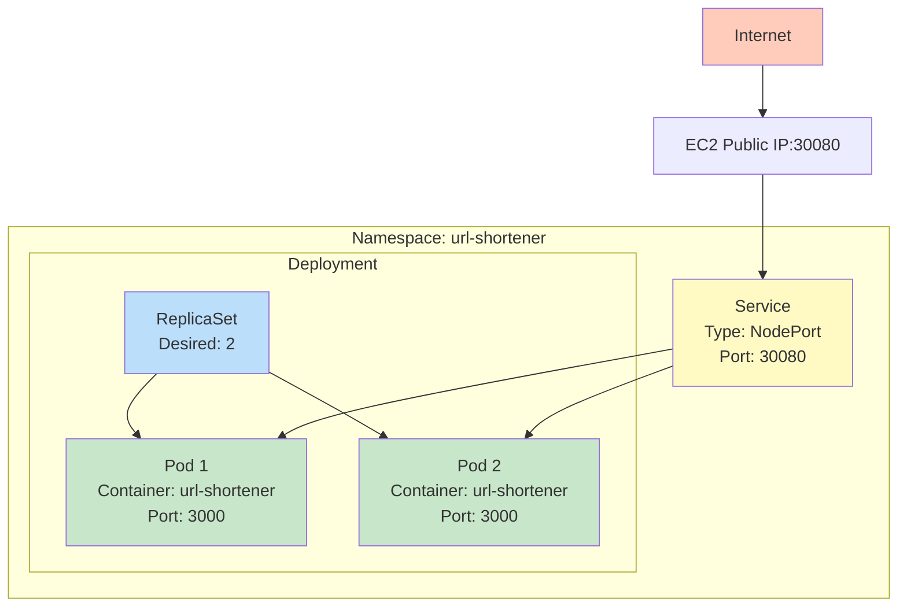
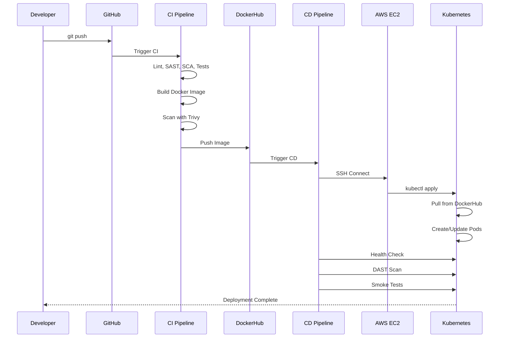
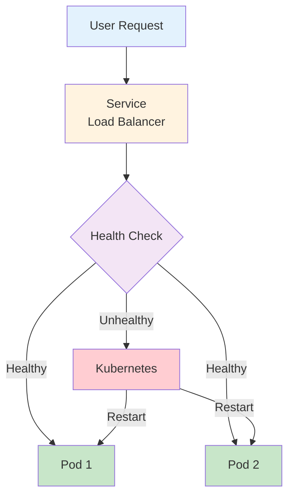

# CI/CD Architecture

## Complete Pipeline Flow

```mermaid
graph TB
    subgraph "Developer"
        A[Code Push to GitHub]
    end
    
    subgraph "CI Pipeline - GitHub Actions"
        B[1. Code Quality - ESLint]
        C[2. SAST - CodeQL]
        D[3. SCA - npm audit]
        E[4. Unit Tests - Jest]
        F[5. Build Verification]
        G[6. Docker Build]
        H[7. Container Scan - Trivy]
        I[8. Runtime Test]
        J[9. Push to DockerHub]
    end
    
    subgraph "Artifact Registry"
        K[DockerHub<br/>dakshkanaujia/url-shortener:latest]
    end
    
    subgraph "CD Pipeline - GitHub Actions"
        L[1. SSH to EC2]
        M[2. Deploy to K3s]
        N[3. Health Check]
        O[4. DAST - OWASP ZAP]
        P[5. Smoke Tests]
    end
    
    subgraph "AWS Cloud"
        subgraph "EC2 Instance t2.micro"
            subgraph "K3s Kubernetes Cluster"
                Q[Pod 1<br/>url-shortener]
                R[Pod 2<br/>url-shortener]
                S[Service<br/>NodePort 30080]
            end
        end
    end
    
    subgraph "Users"
        T[Internet Users<br/>http://EC2-IP:30080]
    end
    
    A --> B
    B --> C
    C --> D
    D --> E
    E --> F
    F --> G
    G --> H
    H --> I
    I --> J
    J --> K
    K --> L
    L --> M
    M --> N
    N --> O
    O --> P
    P --> Q
    P --> R
    S --> Q
    S --> R
    T --> S
    
    style A fill:#e1f5ff
    style K fill:#fff4e1
    style Q fill:#e8f5e9
    style R fill:#e8f5e9
    style S fill:#f3e5f5
    style T fill:#fce4ec
```

## Security Layers

```mermaid
graph LR
    subgraph "Shift-Left Security"
        A[Code] --> B[SAST<br/>CodeQL]
        B --> C[SCA<br/>npm audit]
        C --> D[Container Scan<br/>Trivy]
        D --> E[DAST<br/>OWASP ZAP]
    end
    
    style B fill:#ffcdd2
    style C fill:#f8bbd0
    style D fill:#e1bee7
    style E fill:#d1c4e9
```

## Kubernetes Architecture

```mermaid
graph TB
    subgraph "Namespace: url-shortener"
        subgraph "Deployment"
            A[ReplicaSet<br/>Desired: 2]
            A --> B[Pod 1<br/>Container: url-shortener<br/>Port: 3000]
            A --> C[Pod 2<br/>Container: url-shortener<br/>Port: 3000]
        end
        
        D[Service<br/>Type: NodePort<br/>Port: 30080]
        D --> B
        D --> C
    end
    
    E[Internet] --> F[EC2 Public IP:30080]
    F --> D
    
    style A fill:#bbdefb
    style B fill:#c8e6c9
    style C fill:#c8e6c9
    style D fill:#fff9c4
    style E fill:#ffccbc
```

## Deployment Flow

```mermaid
sequenceDiagram
    participant Dev as Developer
    participant GH as GitHub
    participant CI as CI Pipeline
    participant DH as DockerHub
    participant CD as CD Pipeline
    participant EC2 as AWS EC2
    participant K8s as Kubernetes
    
    Dev->>GH: git push
    GH->>CI: Trigger CI
    CI->>CI: Lint, SAST, SCA, Tests
    CI->>CI: Build Docker Image
    CI->>CI: Scan with Trivy
    CI->>DH: Push Image
    DH->>CD: Trigger CD
    CD->>EC2: SSH Connect
    EC2->>K8s: kubectl apply
    K8s->>K8s: Pull from DockerHub
    K8s->>K8s: Create/Update Pods
    CD->>K8s: Health Check
    CD->>K8s: DAST Scan
    CD->>K8s: Smoke Tests
    K8s-->>Dev: Deployment Complete
```

## High Availability Design

```mermaid
graph TB
    A[User Request] --> B[Service<br/>Load Balancer]
    B --> C{Health Check}
    C -->|Healthy| D[Pod 1]
    C -->|Healthy| E[Pod 2]
    C -->|Unhealthy| F[Kubernetes]
    F -->|Restart| D
    F -->|Restart| E
    
    style A fill:#e3f2fd
    style B fill:#fff3e0
    style C fill:#f3e5f5
    style D fill:#c8e6c9
    style E fill:#c8e6c9
    style F fill:#ffcdd2
```
